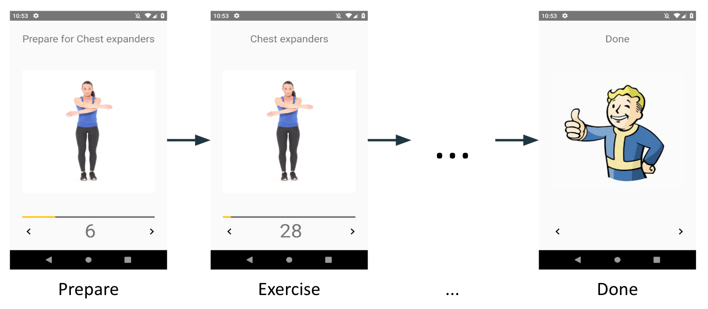

# 第39条：类层次结构优于标签类

在大型项目中，找到具有固定“模式”的类并不罕见，这些模式指定了一个类应该如何工作，我们称这些类为“标记类（tagged class）”，因为它们包含指定其操作模式的标记。它们存在许多问题，而这些问题大多源于不同模式的不同职责在同一层级中相互争夺，尽管它们通常是可以区分的。例如，在下面代码块中，我们可以让这个类来测试 `value` 是否满足某个条件，这个例子是简单的，但它是一个来自大型项目的真实案例：

```kotlin
class ValueMatcher<T> private constructor(
    private val value: T? = null,
    private val matcher: Matcher
){
    
    fun match(value: T?) = when(matcher) {
        Matcher.EQUAL -> value == this.value
        Matcher.NOT_EQUAL -> value != this.value
        Matcher.LIST_EMPTY -> value is List<*> && value.isEmpty()
        Matcher.LIST_NOT_EMPTY -> value is List<*> && value.isNotEmpty()
    }
    
    enum class Matcher {
        EQUAL,
        NOT_EQUAL,
        LIST_EMPTY,
        LIST_NOT_EMPTY
    }
    
    companion object {
        fun <T> equal(value: T) = ValueMatcher<T>(value = value, matcher = Matcher.EQUAL)
        
        fun <T> notEqual(value: T) = ValueMatcher<T>(value = value, matcher =
Matcher.NOT_EQUAL)

        fun <T> emptyList() = ValueMatcher<T>(matcher = Matcher.LIST_EMPTY)
        
        fun <T> notEmptyList() = ValueMatcher<T>(matcher =
Matcher.LIST_NOT_EMPTY)
    }
}
```

这种方法有很多缺点：

* 在一个类中要处理多个模式的样板
* 使用不一致的属性，因为它们用于不同的目的。 此外，对象一般持有比它们所需更多的属性，因为其它模式可能需要这些属性，例如，在上面的例子中，当模式为 `LIST_EMPTY` 或 `LIST_NOT_EMPTY` 时，value 是没有用的
* 当元素有多种用途，且可以通过几种方式设置时，很难保护状态的一致性和正确性
* 通常需要使用工厂方法，否则很难保证对象被正确创建

在 Kotlin 中，我们有一个更好的方案来替代标记类：sealed class（密封类）。我们应该为每个模式定义多个类，并使用类型系统允许它们的多态引用，而不是在单个类中积累多个模式。然后，附加的 sealed 修饰符将这些类密封为一组替代。以下是它们如何被执行的：

```kotlin
sealed class ValueMatcher<T> {
    abstract fun match(value: T): Boolean
    
    class Equal<T>(val value: T) : ValueMatcher<T>() {
        override fun match(value: T): Boolean =
            value == this.value
    }
    
    class NotEqual<T>(val value: T) : ValueMatcher<T>() {
        override fun match(value: T): Boolean =
            value != this.value
    }
    
    class EmptyList<T>() : ValueMatcher<T>() {
        override fun match(value: T) = 
            value is List<*> && value.isEmpty()
    }
    
    class NotEmptyList<T>() : ValueMatcher<T>() {
        override fun match(value: T) =
            value is List<*> && value.isNotEmpty()
    }
}
```

这样的实现要干净得多，因为模式之间没有相互依赖而导致产生多重责任。每个对象只有它所需要的属性，并且可以定义它愿意拥有的参数。使用类层次结构可以消除标记类的所有缺点。

### sealed 修饰符

我们不一定需要使用密封类。我们可以使用 `abstract` 来代替，但是密封禁止在该文件之外定义任何子类。正因如此，如果我们在 `when` 中涵盖了其所有子类型，我们就不需要添加 `else` 分支，因为它能保证是齐全的。利用这个优势，我们可以很容易地添加新功能，并且知道不会忘记在这些 `when` 语句中去包含它们。

这是一种很便利的方式，可以定义不同模式下具有不同的行为操作。例如，我们可以使用 `when` 将 `reversed` 定义为扩展函数，而不用在所有的子类中定义这个函数。新的功能可以以这种方式添加到密封类中，甚至可以作为扩展函数：

```kotlin
fun <T> ValueMatcher<T>.reversed(): ValueMatcher<T> =
when (this) {
    is ValueMatcher.EmptyList -> ValueMatcher.NotEmptyList<T>()
    is ValueMatcher.NotEmptyList -> ValueMatcher.EmptyList<T>()
    is ValueMatcher.Equal -> ValueMatcher.NotEqual(value)
    is ValueMatcher.NotEqual -> ValueMatcher.Equal(value)
}
```

另一方面，当不用密封类而是使用 `abstract` 抽象时，我们就允许其他开发人员在我们控制之外创建实例。在这种情况下，我们应该将函数声明为抽象的，并在子类中实现它们，因为如果使用 `when`，当在项目外部添加新的类时，函数就不能正常工作了。

**`sealed` 修饰符使得为类添加扩展函数或处理该类的不同变体更加容易。抽象类则为加入这个层次结构的新类留有空间**。如果我们想要控制子类，我们应该使用密封类，我们主要在设计继承时才考虑使用抽象。

### 标记类与状态模式并不等同

标记类不应该与状态模式混淆，状态模式是一种行为设计模式，允许对象在内部状态发生变化时改变其行为。这种模式通常用于前端的 controller、presenter 或 viewModel（分别来自 MVC、MVP、MVVM）。例如，假设你为做健身锻炼编写了应用程序，在每组训练前，都有准备阶段，最后，会有一个页面展示你完成了训练。



当我们使用状态模式时，我们有一个表示不同状态的类层次结构，以及一个可读写属性用来表示当前是哪个状态：

```kotlin
sealed class WorkoutState

class PrepareState(val exercise: Exercise) :
WorkoutState()

class ExerciseState(val exercise: Exercise) :
WorkoutState()

object DoneState : WorkoutState()

fun List<Exercise>.toStates(): List<WorkoutState> =
    flatMap { exercise ->
        listOf(PrepareState(exercise),
        ExerciseState(exercise))
    } + DoneState

class WorkoutPresenter( /*...*/ ) {
    private var state: WorkoutState = states.first()
    //...
}
```

这里的区别是：

* 状态是有更多职责的大类中的一部分
* 状态会变化

状态通常保持在单一的可读写属性里。具体的状态用一个对象来表示，我们希望这个对象是一个密封的类层次结构，而不是一个标记类。我们也喜欢它作为一个不可变对象，当需要改变它时，我们可以改变 state 的属性，通常情况下，我们可以观察 state，在以后每次改变时，都更新视图：

```kotlin
private var state: WorkoutState by
    Delegates.observable(states.first()) { _, _, _ ->
        updateView()
    }
```

### 总结

在 Kotlin 中，我们使用类层次结构，而不是标记类。我们通常将这些类型层次结构表示为密封的类，因为它们表示的是一种求和类型（一种集合代替类选项的类型）。它不会与状态模式发生冲突，状态模式在 Kotlin 中是一种流行且有用的模式。它们实际上是协作的，因为我们实现状态时，我们更喜欢使用密封的层次结构，而非标记类。当我们在单个视图上实现复杂但可分离的状态时尤其如此。
